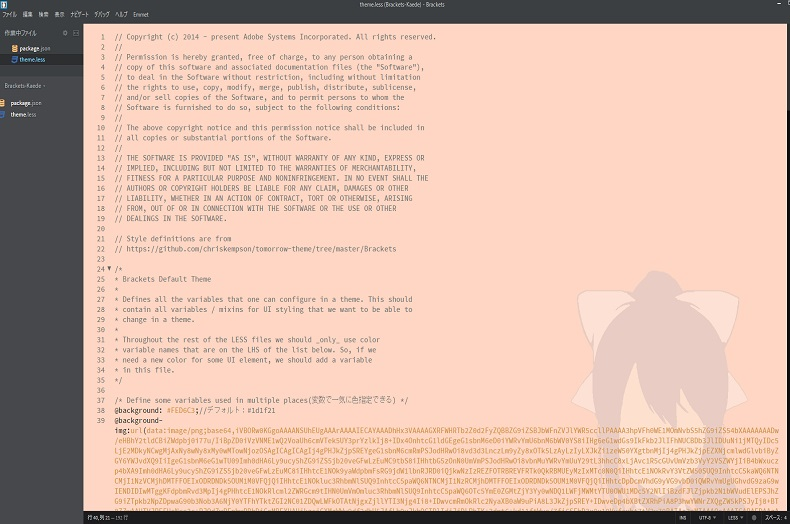

# Brackets-Kaede

## Overview（概要）

■Explanation of English

"Brackets-Kaede" is a customization theme plug-in that can be used with the source code editor "Brackets".

I made Higuchi Kaede Virtual Liver belonging to Ichikara Inc. as a model, and the color of the editor screen chose a orange color close to the image color of the character.

By the way, this theme is an informal theme.

■日本語の説明

「Brackets-Kaede」は、ソースコードエディタ「Brackets」で利用できるカスタマイズテーマプラグインです。

いちから株式会社所属のバーチャルライバー樋口楓さんをモデルに作っており、エディタ画面の色は、キャラのイメージカラーに近しいオレンジっぽい色を選びました。

※ちなみに当テーマは非公式テーマです。
